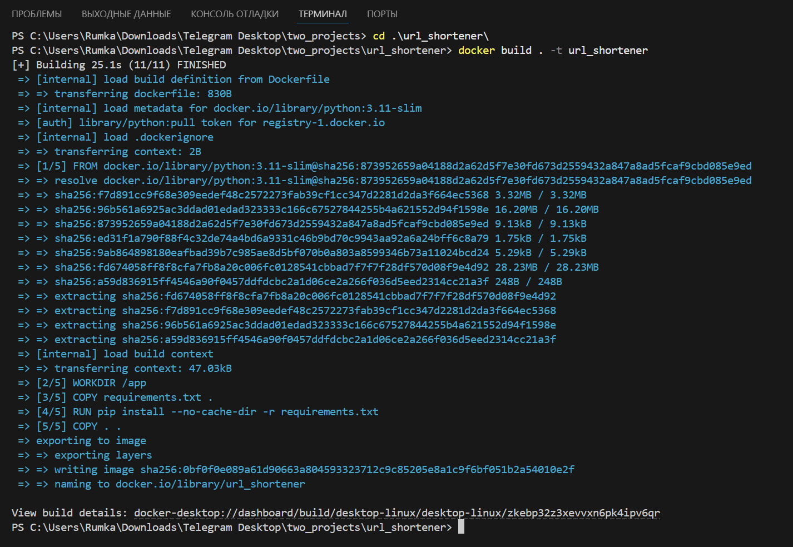

# URL Shortener API

## Описание

Этот проект представляет собой `API` для сокращения `URL` с использованием `FastAPI` и `SQLite`

Он позволяет создавать короткие ссылки, перенаправлять по ним и получать статистику с пагинацией.

## 📁 Структура проекта

```textline
url_shortener/
├── app/
│   ├── __init__.py
│   ├── main.py             # Основной файл с FastAPI и docstrings
│   ├── api/                # Папка для эндпоинтов (API)
│   │   ├── __init__.py
│   │   ├── urls.py         # Эндпоинты для работы с сокращёнными URL
│   │   └── stats.py        # Эндпоинты для статистики и пагинации
│   ├── models/             # Папка для моделей SQLAlchemy
│   │   ├── __init__.py
│   │   └── url_model.py    # Модель для хранения данных о URL
│   ├── schemas/            # Pydantic схемы для валидации данных
│   │   ├── __init__.py
│   │   ├── url_schema.py   # Pydantic схема для входных данных
│   │   └── pagination.py   # Схема для пагинации
│   ├── crud/               # Функции для работы с базой данных
│   │   ├── __init__.py
│   │   ├── url_crud.py     # CRUD операции для URL
│   │   └── pagination.py   # Логика пагинации
│   ├── database/           # Конфигурация базы данных
│   │   ├── __init__.py
│   │   └── db.py           # Инициализация базы данных и сессий
│   ├── main.py             #
│   └── config.py           # Настройки проекта
|
├── database.db             # SQLite база данных
├── requirements.txt        # Зависимости проекта
├── Dockerfile              # Конфигурация для Docker
├── .gitignore              # Файлы и папки, которые будут игнорироваться Git
└── README.md               # Документация проекта
```

## ⚙️ Установка

1. **Клонируйте репозиторий.**
2. **Создайте виртуальное окружение:**
   ```bash
   python -m venv venv
   ```
3. **Активируйте виртуальное окружение:**

- **На Windows:**
   ```bash
   venv\Scripts\activate
   ```

- **На MacOS/Linux:**
   ```bash
   source venv/bin/activate
   ```

- **Установите зависимости:**
   ```bash
   pip install -r requirements.txt
   ```

- **Запустите сервер с помощью Uvicorn:**
   ```bash
   uvicorn app.main:app --reload
   ```

## 🔧 Эндпоинты API

1. `POST` `/shorten`

- **Описание:** Создает короткую ссылку для указанного URL.
- **Тело запроса:**
   ```json
   {
   "url": "https://www.example.com"
   }
   ```
- **Ответ:**
   ```json
   {
   "short_url": "http://127.0.0.1:8000/{short_id}"
   }
   ```

2. `GET` `/{short_id}`

- **Описание:** Перенаправляет на оригинальный URL по короткому идентификатору.
- **Пример:**
   ```bash
   GET /abc123
   ```
- **Ответ:** Перенаправление на исходный URL.

3. `GET` `/stats`

- **Описание:** Получение списка всех сокращенных URL с пагинацией.
- **Пример запроса:**
```bash
GET /stats?page=1&per_page=10
```
- **Ответ:**
```json
{
  "page": 1,
  "per_page": 10,
  "total": 50,
  "urls": [
    {"short_url": "http://127.0.0.1:8000/abc123", "original_url": "https://www.example.com"},
    {"short_url": "http://127.0.0.1:8000/xyz456", "original_url": "https://www.another-example.com"}
  ]
}
```




**View build details:** `docker-desktop://dashboard/build/desktop-linux/desktop-linux/zkebp32z3xevvxn6pk4ipv6qr`

## 📜 Лицензия

Этот проект распространяется под лицензией `MIT`

**См. файл** [LICENSE](LICENSE) для подробной информации.
